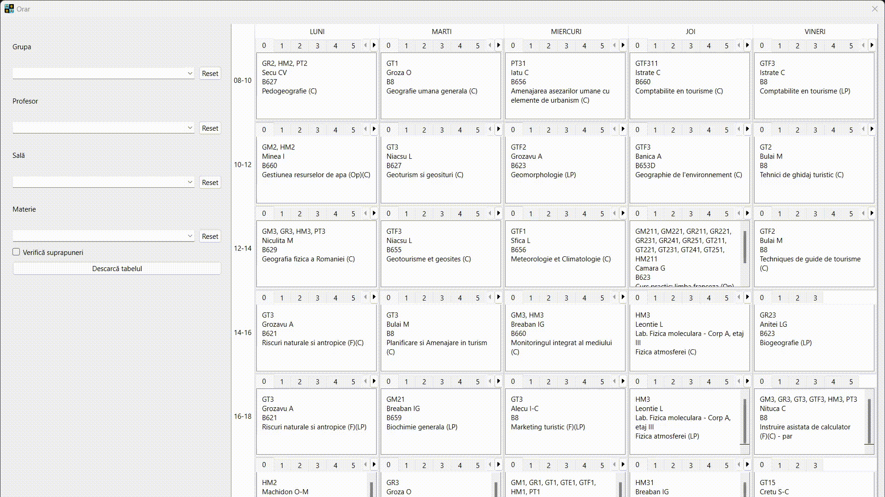
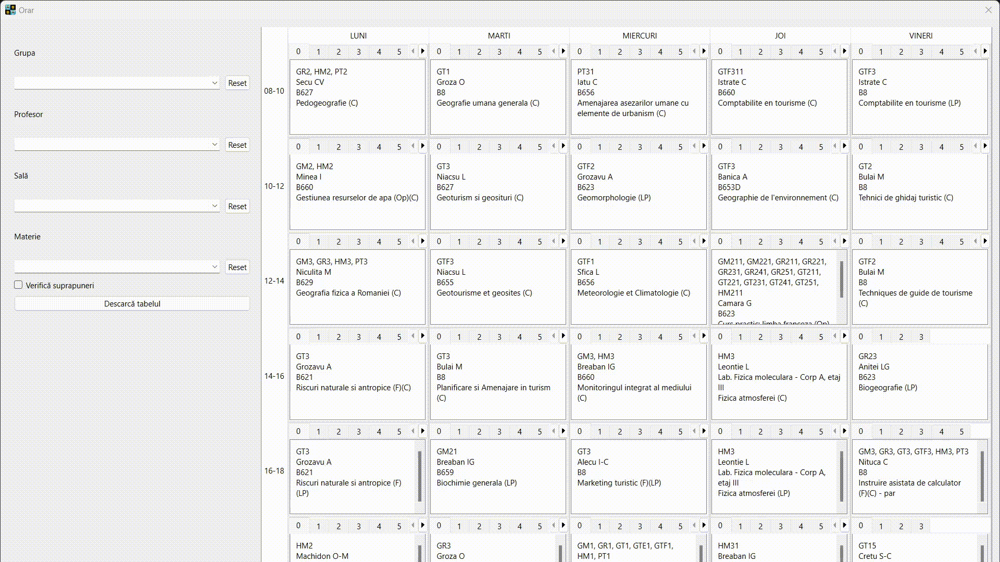

# timetable_geo_uaic

timetable-geo-uaic is a PyQt based app where the bachelor students and the university staff from the Faculty of Geography and Geology Iași can view their timetable.

## Installation

[orar_geo_uaic_WINDOWS_v0.0.2_setup.exe](https://github.com/alecsandrei/timetable_geo_uaic/releases/download/v0.0.2/orar_geo_uaic_WINDOWS_v0.0.2_setup.exe)

## Usage
Run the main.py file or download the binary installer from the above link.

